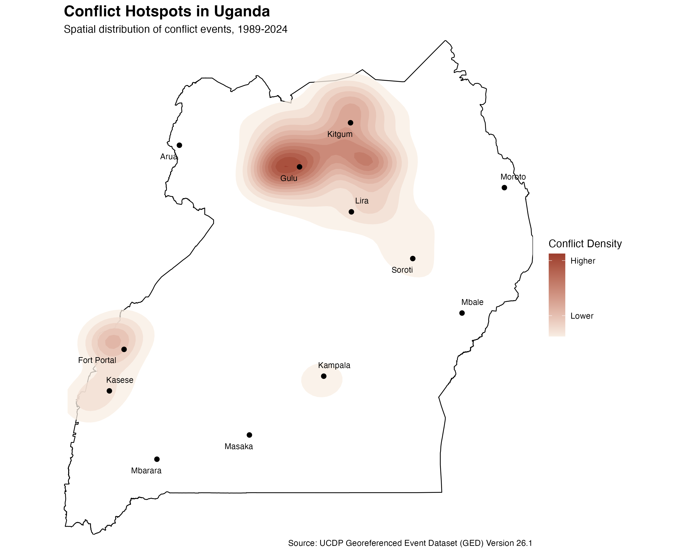
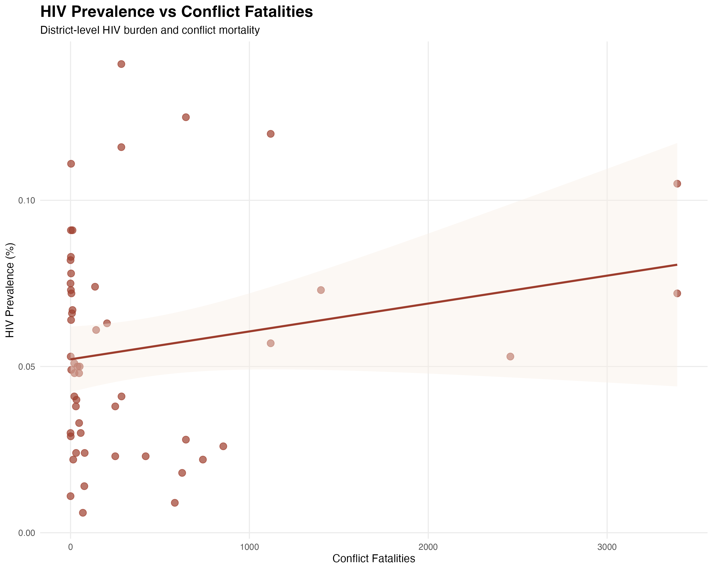
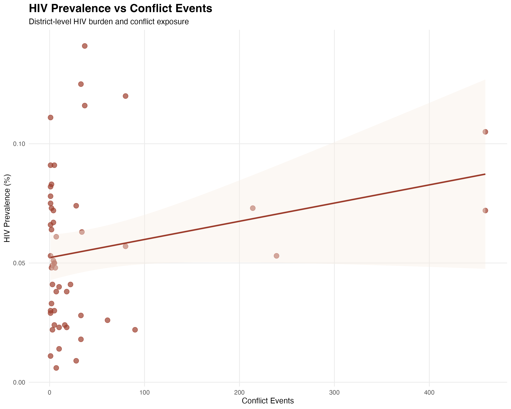
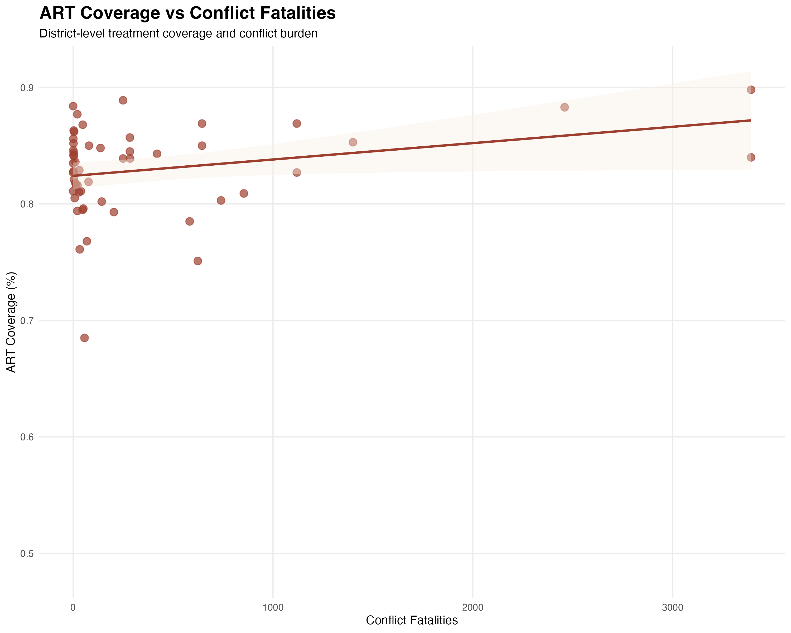

# Uganda HIV Burden and Conflict Exposure: A District-Level Analysis

## Overview

This project examines the relationship between conflict exposure and HIV burden across districts in Uganda by integrating district-level HIV estimates from the Uganda AIDS Commission with conflict event data from the Uppsala Conflict Data Program (UCDP) Georeferenced Event Dataset.

This project emerged from a broader interest in how conflict, displacement, and institutional fragility shape population health. Discussions of HIV often focus on healthcare access, poverty, education, stigma, and behavioral risk factors. Conflict receives less attention despite its potential to disrupt treatment systems, displace communities, alter patterns of mobility, and weaken public institutions that support health.

At the same time, the relationship between conflict and HIV is unlikely to be straightforward. Areas experiencing prolonged insecurity may exhibit elevated HIV burden, but they may also benefit from targeted humanitarian interventions, international assistance, or resilient local health systems. Understanding how these forces interact requires moving beyond national averages and examining variation at a more local level.

Using district-level HIV estimates and georeferenced conflict data, I explored whether districts experiencing greater conflict exposure also exhibit higher HIV prevalence and differences in antiretroviral therapy (ART) coverage. The project combines epidemiologic analysis with spatial conflict data to investigate how insecurity and health intersect within a single national context.

## Research Question

How is conflict exposure associated with HIV outcomes across districts in Uganda?

More specifically:

* Do districts experiencing greater conflict-related mortality exhibit higher HIV prevalence?
* Is HIV prevalence associated with the frequency of conflict events?
* Does ART coverage vary across districts with differing levels of conflict exposure?
* Which districts experience both high HIV burden and high conflict burden?

## Data Sources

This analysis integrates district-level HIV estimates with georeferenced conflict data to examine how patterns of insecurity may intersect with HIV burden across Uganda.

### HIV Data

District-level HIV estimates were obtained from the Uganda AIDS Commission's *Sub-National HIV Estimates (2023)* report and manually transcribed into a structured dataset for analysis.

Variables included:

* HIV prevalence
* People living with HIV (PLHIV)
* Annual new HIV infections
* Antiretroviral therapy (ART) coverage

The estimates represent district-level snapshots of Uganda's HIV epidemic as of 2023.

### Conflict Data

Conflict data were obtained from the Uppsala Conflict Data Program (UCDP) Georeferenced Event Dataset (GED) Version 26.1.

The dataset contains geocoded records of conflict events, including:

* Event locations
* Conflict-related fatalities
* Geographic coordinates
* Administrative districts
* Event dates

This analysis included all conflict events recorded in Uganda between 1989 and 2024.

### Data Availability

The datasets used in this project are publicly available:

* Uganda AIDS Commission. *Sub-National HIV Estimates (2023)*
* Uppsala Conflict Data Program (UCDP). *Georeferenced Event Dataset (GED) Version 26.1*

A structured district-level HIV dataset was manually created from publicly available Uganda AIDS Commission estimates and is included in this repository as **Sub_National_HIV_Estimates_2023.xlsx**.

## Methods

The HIV and conflict datasets were processed separately before being merged at the district level.

Conflict events were aggregated by district to calculate total conflict events and total conflict-related fatalities. Several administrative units required harmonization because HIV estimates distinguish some city districts from surrounding districts, whereas the conflict dataset reports events using broader administrative classifications.

Following data cleaning and harmonization, the datasets were merged to create a district-level analytical file.

The analysis included descriptive comparisons, exploratory correlation analyses, identification of districts experiencing both high HIV burden and high conflict burden, and a separate spatial hotspot analysis using georeferenced conflict events.

All data processing, analysis, and visualization were conducted in R.

## Key Visualizations

### Conflict Hotspots in Uganda

### HIV Prevalence vs Conflict Fatalities

### HIV Prevalence vs Conflict Events

### ART Coverage vs Conflict Fatalities

## Findings

### Conflict and HIV Appear Related, Though Not Strongly

The analysis identified weak positive relationships between HIV prevalence and both conflict fatalities and conflict event counts. Districts experiencing greater conflict exposure tended to exhibit somewhat higher HIV prevalence.

What is perhaps more notable is the modest size of these relationships. Prior to conducting the analysis, one might reasonably expect conflict exposure to emerge as a major explanatory factor. Instead, the results suggest a more complicated picture.

Conflict appears to matter, but it does not appear sufficient on its own to explain district-level variation in HIV burden across Uganda.

### ART Coverage Remained Relatively High

One of the more surprising findings was the consistency of ART coverage across districts.

If conflict were severely disrupting HIV treatment systems, one might expect districts with higher conflict burden to exhibit substantially poorer treatment coverage. Instead, ART coverage remained relatively strong across much of the country, including several districts with substantial historical conflict exposure.

This finding may reflect the strength of Uganda's HIV response, as well as decades of investment in HIV treatment infrastructure by governmental, community-based, and international partners.

### Geography Tells a Different Story

The conflict hotspot analysis revealed a clear concentration of conflict activity in northern Uganda, particularly around Gulu, Kitgum, and neighboring districts that experienced prolonged periods of violence associated with the Lord's Resistance Army insurgency.

At the same time, some of the districts with the highest HIV prevalence were located outside the country's most intense conflict zones.

This geographic pattern helps explain the relatively modest statistical relationships observed in the analysis. Conflict burden and HIV burden overlap in some locations, but they do not share identical spatial distributions. The geography of conflict and the geography of HIV appear related without being interchangeable.

### Conflict Is Not the Whole Explanation

Perhaps the most interesting finding is not that conflict and HIV are related, but that the relationship is weaker than one might expect.

The district-level patterns suggest that HIV burden reflects the interaction of multiple forces operating simultaneously. Healthcare access, migration, economic conditions, demographic characteristics, transportation networks, and historical experiences of conflict likely shape outcomes together rather than independently.

Conflict remains an important part of the story, but it does not appear to be the entire story.

## Limitations

Several limitations should be considered when interpreting these findings.

The analysis is descriptive and cannot establish causal relationships.

Conflict exposure was measured using cumulative event counts and fatalities, which may not fully capture the lived experience of insecurity, displacement, or social disruption. District boundaries and administrative classifications differed across datasets and required harmonization during the merging process.

In addition, HIV outcomes are influenced by numerous factors that were not incorporated into this analysis, including socioeconomic conditions, migration patterns, healthcare infrastructure, and population demographics.

Finally, correlation analyses may obscure more complex spatial or nonlinear relationships that could emerge through alternative modeling approaches.

## Conclusion

This project explored the relationship between HIV burden and conflict exposure across districts in Uganda using district-level HIV estimates and georeferenced conflict data.

While districts with greater conflict exposure tended to exhibit slightly higher HIV prevalence, the observed relationships were weak and explained only a small portion of district-level variation in HIV burden.

At the same time, ART coverage remained consistently high across much of the country, suggesting substantial resilience within Uganda's HIV response system.

The findings ultimately suggest that understanding HIV outcomes requires looking beyond conflict alone. The patterns observed here appear to reflect not only experiences of violence and insecurity, but also the broader social, economic, demographic, and institutional environments in which health systems operate.

Future work could incorporate displacement data, refugee settlement locations, socioeconomic indicators, and spatial modeling approaches to better understand how conflict shapes HIV vulnerability at the local level.

## Repository Contents

### Scripts

* uganda_conflict_hiv_project.R
* uganda_hiv_conflict_analysis.R

### Figures

* uganda_conflict_hotspots.png
* hiv_prevalence_vs_conflict_fatalities.png
* hiv_prevalence_vs_conflict_events.png
* art_coverage_vs_conflict_fatalities.png
* top_hiv_prevalence_districts.png
* top_conflict_fatality_districts.png

### Data

* Sub_National_HIV_Estimates_2023.xlsx

## Author

**Parisa Ayoubi, MPH**

Research interests include HIV/AIDS, conflict and displacement, health inequities, global health, MENA populations, and spatial epidemiology.
